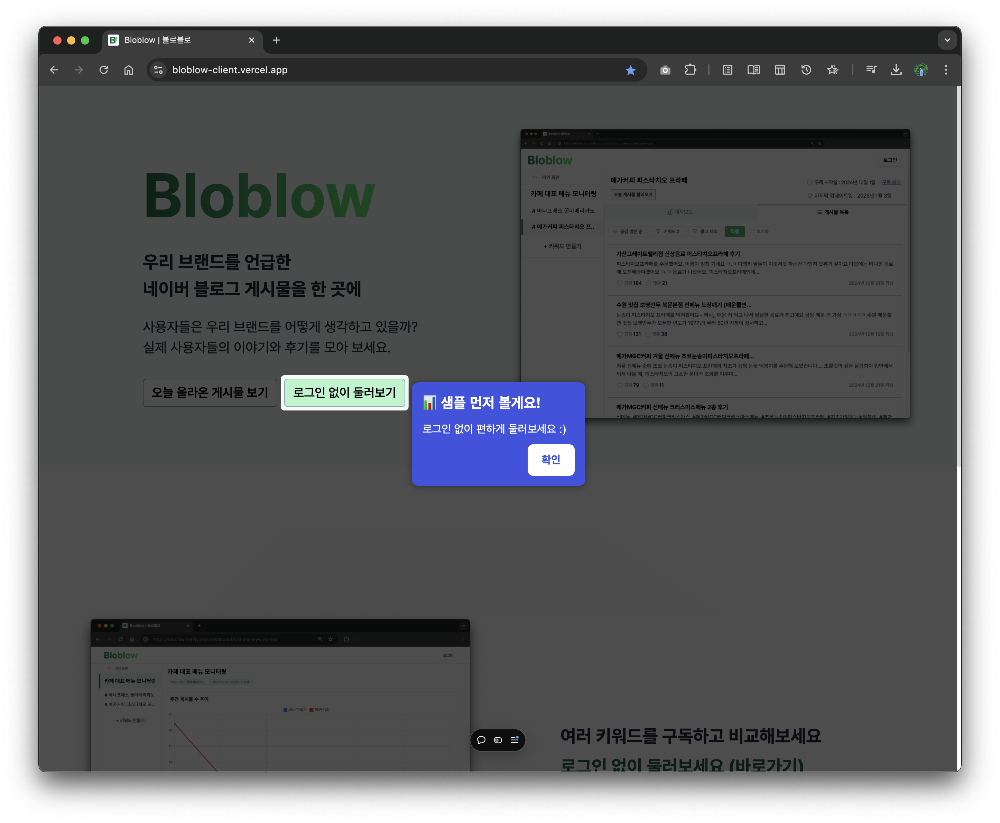

# welcome-toast

<div align="center">
  <p>
    <b>스크립트 한 줄로 끝.</b><br/>
    <b>개발자 도움 없이 웹사이트에 토스트 메시지와 툴팁을 5분 만에 추가해보세요!</b><br/>
    <b>-</b>
  </p>
  GitHub
  <a href="https://github.com/welcome-toast/welcome-toast">연동 스크립트</a> | <a href="https://github.com/welcome-toast/admin">관리자 페이지</a><br/>
    개발기간 4주 (2024.12.04 ~ 12.22 / 2025.01.04 ~ 01.10)
</div>

<br>


<br>
<br>

# 목차

<!-- toc -->

- [1. 개발 배경](#1-%EA%B0%9C%EB%B0%9C-%EB%B0%B0%EA%B2%BD)
  * [1-1. 처음 방문한 웹사이트를 바로 떠난 적 있으신가요?](#1-1-%EC%B2%98%EC%9D%8C-%EB%B0%A9%EB%AC%B8%ED%95%9C-%EC%9B%B9%EC%82%AC%EC%9D%B4%ED%8A%B8%EB%A5%BC-%EB%B0%94%EB%A1%9C-%EB%96%A0%EB%82%9C-%EC%A0%81-%EC%9E%88%EC%9C%BC%EC%8B%A0%EA%B0%80%EC%9A%94)
  * [1-2. 손이 많이 가는 토스트 메시지, 이제 누구나 쉽게 만들 수 있도록.](#1-2-%EC%86%90%EC%9D%B4-%EB%A7%8E%EC%9D%B4-%EA%B0%80%EB%8A%94-%ED%86%A0%EC%8A%A4%ED%8A%B8-%EB%A9%94%EC%8B%9C%EC%A7%80-%EC%9D%B4%EC%A0%9C-%EB%88%84%EA%B5%AC%EB%82%98-%EC%89%BD%EA%B2%8C-%EB%A7%8C%EB%93%A4-%EC%88%98-%EC%9E%88%EB%8F%84%EB%A1%9D)
- [2. 기술 스택](#2-%EA%B8%B0%EC%88%A0-%EC%8A%A4%ED%83%9D)
  * [2-1. 연동 스크립트](#2-1-%EC%97%B0%EB%8F%99-%EC%8A%A4%ED%81%AC%EB%A6%BD%ED%8A%B8)
  * [2-2. 관리자 페이지](#2-2-%EA%B4%80%EB%A6%AC%EC%9E%90-%ED%8E%98%EC%9D%B4%EC%A7%80)
- [3. 기능](#3-%EA%B8%B0%EB%8A%A5)
  * [3-1. 코드 한 줄로 끝나는 연동](#3-1-%EC%BD%94%EB%93%9C-%ED%95%9C-%EC%A4%84%EB%A1%9C-%EB%81%9D%EB%82%98%EB%8A%94-%EC%97%B0%EB%8F%99)
  * [3-2. 관리자 페이지 만으로 토스트 메시지 개인화](#3-2-%EA%B4%80%EB%A6%AC%EC%9E%90-%ED%8E%98%EC%9D%B4%EC%A7%80-%EB%A7%8C%EC%9C%BC%EB%A1%9C-%ED%86%A0%EC%8A%A4%ED%8A%B8-%EB%A9%94%EC%8B%9C%EC%A7%80-%EA%B0%9C%EC%9D%B8%ED%99%94)
- [4. 개발 과정](#4-%EA%B0%9C%EB%B0%9C-%EA%B3%BC%EC%A0%95)
  * [4-1. SDK 설계의 3가지 고민: 사용성, 쉬운 연동, 보안 (작성중)](#4-1-sdk-%EC%84%A4%EA%B3%84%EC%9D%98-3%EA%B0%80%EC%A7%80-%EA%B3%A0%EB%AF%BC-%EC%82%AC%EC%9A%A9%EC%84%B1-%EC%89%AC%EC%9A%B4-%EC%97%B0%EB%8F%99-%EB%B3%B4%EC%95%88-%EC%9E%91%EC%84%B1%EC%A4%91)
  * [4-2. 토스트 메시지 UI 구현하기](#4-2-%ED%86%A0%EC%8A%A4%ED%8A%B8-%EB%A9%94%EC%8B%9C%EC%A7%80-ui-%EA%B5%AC%ED%98%84%ED%95%98%EA%B8%B0)
    + [4-2-1. 반응형을 고려하여 타겟 요소의 위치 계산하기](#4-2-1-%EB%B0%98%EC%9D%91%ED%98%95%EC%9D%84-%EA%B3%A0%EB%A0%A4%ED%95%98%EC%97%AC-%ED%83%80%EA%B2%9F-%EC%9A%94%EC%86%8C%EC%9D%98-%EC%9C%84%EC%B9%98-%EA%B3%84%EC%82%B0%ED%95%98%EA%B8%B0)
    + [4-2-2. 타겟을 강조하는 배경, 토스트 메시지 동적으로 만들기 (오버레이, 팝오버 구현)](#4-2-2-%ED%83%80%EA%B2%9F%EC%9D%84-%EA%B0%95%EC%A1%B0%ED%95%98%EB%8A%94-%EB%B0%B0%EA%B2%BD-%ED%86%A0%EC%8A%A4%ED%8A%B8-%EB%A9%94%EC%8B%9C%EC%A7%80-%EB%8F%99%EC%A0%81%EC%9C%BC%EB%A1%9C-%EB%A7%8C%EB%93%A4%EA%B8%B0-%EC%98%A4%EB%B2%84%EB%A0%88%EC%9D%B4-%ED%8C%9D%EC%98%A4%EB%B2%84-%EA%B5%AC%ED%98%84)
  * [4-3. Single Page Application에서도 동작할 수 있을까?](#4-3-single-page-application%EC%97%90%EC%84%9C%EB%8F%84-%EB%8F%99%EC%9E%91%ED%95%A0-%EC%88%98-%EC%9E%88%EC%9D%84%EA%B9%8C)
    + [4-3-1. `MutationObserver API`를 활용한 DOM 변화 추적](#4-3-1-mutationobserver-api%EB%A5%BC-%ED%99%9C%EC%9A%A9%ED%95%9C-dom-%EB%B3%80%ED%99%94-%EC%B6%94%EC%A0%81)
    + [4-3-2. 예상보다 빈번한 DOM 변화에 대응하기 (Observer on/off 시점 구분)](#4-3-2-%EC%98%88%EC%83%81%EB%B3%B4%EB%8B%A4-%EB%B9%88%EB%B2%88%ED%95%9C-dom-%EB%B3%80%ED%99%94%EC%97%90-%EB%8C%80%EC%9D%91%ED%95%98%EA%B8%B0-observer-onoff-%EC%8B%9C%EC%A0%90-%EA%B5%AC%EB%B6%84)
  * [4-4. 개발자가 아니어도 쉽게, GUI 기반 토스트 메시지 에디터](#4-4-%EA%B0%9C%EB%B0%9C%EC%9E%90%EA%B0%80-%EC%95%84%EB%8B%88%EC%96%B4%EB%8F%84-%EC%89%BD%EA%B2%8C-gui-%EA%B8%B0%EB%B0%98-%ED%86%A0%EC%8A%A4%ED%8A%B8-%EB%A9%94%EC%8B%9C%EC%A7%80-%EC%97%90%EB%94%94%ED%84%B0)
    + [4-4-1. 피그마처럼 보면서, 토스트 메시지를 만들고 바로 적용시킬 수 있으면 어떨까?](#4-4-1-%ED%94%BC%EA%B7%B8%EB%A7%88%EC%B2%98%EB%9F%BC-%EB%B3%B4%EB%A9%B4%EC%84%9C-%ED%86%A0%EC%8A%A4%ED%8A%B8-%EB%A9%94%EC%8B%9C%EC%A7%80%EB%A5%BC-%EB%A7%8C%EB%93%A4%EA%B3%A0-%EB%B0%94%EB%A1%9C-%EC%A0%81%EC%9A%A9%EC%8B%9C%ED%82%AC-%EC%88%98-%EC%9E%88%EC%9C%BC%EB%A9%B4-%EC%96%B4%EB%96%A8%EA%B9%8C)
    + [4-4-2. 에디터에서 웹사이트 미리보기를 어떻게 구현할까? : `fetch` vs `iframe`](#4-4-2-%EC%97%90%EB%94%94%ED%84%B0%EC%97%90%EC%84%9C-%EC%9B%B9%EC%82%AC%EC%9D%B4%ED%8A%B8-%EB%AF%B8%EB%A6%AC%EB%B3%B4%EA%B8%B0%EB%A5%BC-%EC%96%B4%EB%96%BB%EA%B2%8C-%EA%B5%AC%ED%98%84%ED%95%A0%EA%B9%8C--fetch-vs-iframe)
    + [4-4-3. 클릭만으로 웹사이트 요소의 id를 관리자 페이지로 가져오는 방법](#4-4-3-%ED%81%B4%EB%A6%AD%EB%A7%8C%EC%9C%BC%EB%A1%9C-%EC%9B%B9%EC%82%AC%EC%9D%B4%ED%8A%B8-%EC%9A%94%EC%86%8C%EC%9D%98-id%EB%A5%BC-%EA%B4%80%EB%A6%AC%EC%9E%90-%ED%8E%98%EC%9D%B4%EC%A7%80%EB%A1%9C-%EA%B0%80%EC%A0%B8%EC%98%A4%EB%8A%94-%EB%B0%A9%EB%B2%95)
- [5. 레퍼런스 분석](#5-%EB%A0%88%ED%8D%BC%EB%9F%B0%EC%8A%A4-%EB%B6%84%EC%84%9D)
    + [5-1. 안정성 높은 SDK: 채널톡과 인터콤(Intercom)](#5-1-%EC%95%88%EC%A0%95%EC%84%B1-%EB%86%92%EC%9D%80-sdk-%EC%B1%84%EB%84%90%ED%86%A1%EA%B3%BC-%EC%9D%B8%ED%84%B0%EC%BD%A4intercom)
    + [5-2. 유사 서비스: driver.js](#5-2-%EC%9C%A0%EC%82%AC-%EC%84%9C%EB%B9%84%EC%8A%A4-driverjs)

<!-- tocstop -->

<br>
<br>

# 1. 개발 배경

## 1-1. 처음 방문한 웹사이트를 바로 떠난 적 있으신가요?

유저는 처음 방문한 웹사이트가 어렵습니다. 웹 서비스들을 보면서 처음 서비스를 방문하는 사용자에게 기능 소개, 튜토리얼 등이 더 친절하다면 좋겠다는 생각을 했습니다. 대체로 프로젝트의 런칭일이 다가옴에 따라, 중요한 기능에 집중하고 오류 점검에 바쁘기 마련입니다. 사용자를 위해 친절하게 새로운 소식을 알려주면 좋겠지만, 최종 점검으로 바쁘기 때문에 엄두가 나질 않습니다.

하지만 이렇게 런칭한 웹사이트에 사용자가 들어오면 어떨까요? 웹사이트에 처음 방문한 유저는 무엇을 해야할지 감을 잡기 어려울 수 있습니다.

<br>

## 1-2. 손이 많이 가는 토스트 메시지, 이제 누구나 쉽게 만들 수 있도록.

메시지 하나로 충분히 사용자를 붙잡을 수 있습니다. 하지만 직접 구현하기에 보기 보다 손이 많이 갑니다. 타겟을 강조하고, 토스트를 띄우고, 창이 줄어드면 위치도 바뀌고 등등. 또 언제나 수정이 발생할 수 있는데, 이 과정을 처음부터 반복하고 배포도 해야합니다.

이제 @welcome-toast로 빠르게 만들고 수정할 수 있습니다. 제공되는 스크립트로 연동하고 강조할 요소의 id만 심어주세요. 관리자 페이지에서 곧바로 토스트 메시지를 만들고 적용할 수 있습니다. 스크립트 한 줄만으로 개발자 도움 없이, 웹사이트 운영자 누구나 토스트 메시지를 설정할 수 있습니다. 어렵게 방문한 사용자가 떠나지 않도록, 방문한 유저에게 새로운 기능이나 콘텐츠 소식을 알려주면 어떨까요?


<br>
<br>

# 2. 기술 스택

## 2-1. 연동 스크립트

<table>
  <thead>
    <tr style="border-bottom: 2px solid #000000">
      <th style="width: 50%; border-right: 1px solid #000000">개발</th>
      <th style="width: 50%; border-right: 1px solid #000000">배포(CDN)</th>
    </tr>
  </thead>
  <tbody>
    <tr>
      <td style="border-right: 1px solid #000000">
        <li>Vanilla JavaScript</li>
      </td>
      <td style="border-right: 1px solid #000000; vertical-align: top">
        <li>jsDelivr</li>
      </td>
    </tr>
  </tbody>
</table>

<br>

## 2-2. 관리자 페이지

<table>
  <thead>
    <tr style="border-bottom: 2px solid #000000">
      <th style="width: 20%; border-right: 1px solid #000000">Frontend</th>
      <th style="width: 20%; border-right: 1px solid #000000">Backend</th>
      <th style="width: 20%; border-right: 1px solid #000000">배포(Frontend)</th>
      <th style="width: 20%; border-right: 1px solid #000000">린터/포매터</th>
    </tr>
  </thead>
  <tbody>
    <tr>
      <td style="border-right: 1px solid #000000">
        <li>React</li>
        <li>React Router</li>
        <li>Tailwind CSS</li>
        <li>Vite</li>
      </td>
      <td style="border-right: 1px solid #000000; vertical-align: top">
        <li>Supabase</li>
      </td>
      <td style="border-right: 1px solid #000000; vertical-align: top">
        <li>Netlify</li>
      </td>
      <td style="border-right: 1px solid #000000; vertical-align: top">
        <li>Biome</li>
      </td>
    </tr>
  </tbody>
</table>

<br>
<br>

# 3. 기능

## 3-1. 코드 한 줄로 끝나는 연동

<table>
  <tr>
  <td width="50%">
    
  </td>
  <td width="50%">

  **웹사이트 연동 예시**
  - 스크립트 연동 후 배포 상태라면 토스트를 적용할 준비가 끝난 상태예요.
  - 강조할 타겟 요소의 id를 심고 관리자 페이지에서 입력/선택해 주세요.

  </td>

  </tr>
</table>

<br>

## 3-2. 관리자 페이지 만으로 토스트 메시지 개인화

<table>
  <tr>
  <td width="50%">
    
  </td>
  <td width="50%">

  **에디터 / 미리보기**
  - 연동한 웹사이트에 적용할 토스트를 미리 보면서 편집할 수 있습니다.
  - 메시지 제목/본문, 타겟 요소, 이미지, 배경 불투명도를 설정할 수 있습니다.
  - 연속된 여러 토스트를 만들고 설정할 수 있습니다.

  </td>

  </tr>
  <tr>
  <td width="50%">
    
  </td>
  <td width="50%">

  **프로젝트 목록**
  - 연동할 여러 웹사이트를 프로젝트 단위로 등록합니다.
  - 현재 등록 웹사이트 URL은 고유해야 하며, 중복으로 등록할 수 없습니다.

  </td>

  </tr>
</table>

<br>
<br>

# 4. 개발 과정

## 4-1. SDK 설계의 3가지 고민: 사용성, 쉬운 연동, 보안 (작성중)

사용자의 서비스에 연동된 스크립트는 본 프로젝트(웰컴토스트)의 DB와 통신합니다. 웹사이트에 적용할 토스트 메시지 목록을 요청하고, 어드민 페이지로 저장된 토스트 목록을 응답으로 받습니다.


<br>

**사용자 시나리오**

1. 사용자: admin 로그인
2. 사용자: 프로젝트 생성 (URL 입력, DB 저장) → project에 할당된 고유 `api_key` 포함한 script 생성
3. 사용자: script 삽입, prod 배포 (배포 필수)
4. 사용자: admin 에디터 진입 후 preview 이용


<br>
<br>

## 4-2. 토스트 메시지 UI 구현하기

타겟 요소를 정확히 찾고 위치를 계산하는 것이 첫 과제였습니다. 문서 내 요소를 안정적으로 특정하기 위해 고유한 id 속성을 기준으로 활용했습니다.

### 4-2-1. 반응형을 고려하여 타겟 요소의 위치 계산하기

현재 사용자에게 보이는 뷰포트를 기준으로 타겟 요소의 상대적 위치를 반환하는 `Element.getBoundingClientRect()` 메소드를 위치 계산에 핵심적으로 활용했습니다. 계산하고자 하는 타겟 요소의 크기, 위치는 고정된 값이 아니었습니다. 특히 scroll, resize시에도 활용 가능한 위치를 동적으로 계산해야 했기 때문에, 해당 메소드를 활용했습니다.

또한 메소드를 활용한 계산이 반복되어, `getWindowAndTargetSizePosition` 라는 함수로 추상화를 했습니다.

```js
// 최초 토스트 적용, 동적으로 위치 조정시 활용하기 위해 함수 추상화
function getWindowAndTargetSizePosition(targetElement) {
  // 현재 사용자가 보는 뷰포트 크기
  const { width: widthViewport, height: heightViewport } = window.visualViewport;
  const {
    width: widthTarget, height: heightTarget, // 현재 타겟의 크기
    x: xTarget, y: yTarget, right, bottom,  // 현재 타겟의 위치
  } = targetElement.getBoundingClientRect();
  // ...
}
```

추상화 한 함수는 최초 계산 시점을 비롯해, scroll 이벤트와 resize 이벤트의 핸들러 내부에서 활용했습니다. 이를 통해, 배경과 토스트 메시지의 위치 및 크기 정보를 동적으로 계산하고 적용했습니다. 계산 시점의 window viewport 사이즈와 `Element.getBoundingClientRect()` 메소드가 반환하는 DOMRect 객체로 타겟 요소의 위치, 크기 정보를 얻어 토스트 메시지 위치 속성값을 를 동적으로 조정할 수 있도록 었습니다.

<br>

### 4-2-2. 타겟을 강조하는 배경, 토스트 메시지 동적으로 만들기 (오버레이, 팝오버 구현)


<br>

1. 타겟 요소를 제외한 영역을 어둡게 하는 배경 (overlay)
2. 타겟 요소 표시되는 토스트 메시지 (popover)

<br>

배경은 SVG로 구현했습니다. 전체 화면을 덮되, 타겟 요소만 뚫려 있는 마스크 효과를 주기 위해, `SVG path`의 `fill-rule`을 `evenodd`로 설정했습니다. 사용자가 화면을 스크롤하거나, 브라우저 창의 크기가 변하면 배경, 토스트 메시지의 속성을 모두 업데이트 하도록 했습니다. 배경 및 토스트 메시지의 반응형 대응 방법은, 유사 라이브러리 [driver.js](https://github.com/kamranahmedse/driver.js)의 소스 코드를 레퍼런스로 참고하였습니다. 이에 scroll, resize event의 핸들러를 설정해서 실시간으로 SVG 속성을 업데이트 하고, innerHTML, style 속성을 업데이트 했습니다. 특히 브라우저 창 너비가 줄어들더라도 토스트 메시지가 화면을 벗어나지 않도록 위치를 보정하는 로직을 추가했습니다.

요소 생성(`createElement`, `appendChild`), 속성 설정(`innerHTML`, `style`) 로직을 분리하여 중복으로 요소가 생성되는 케이스를 방지하고 관리가 용이한 구조를 만들었습니다.

```js
function createOverlay() {
  // 배경 요소 생성
}
function createPopover() {
  // 토스트 메시지 요소 생성
}
function setOverlay(
  widthViewport, heightViewport,
  widthTarget, heightTarget, xTarget, yTarget, background_opacity,
) {
  // 배경 위치 초기화 및 업데이트
  // svg, path 속성 업데이트
}
function setPopover(targetElement, message_title, message_body, image_url) {
    // 토스트 메시지 위치 초기화 및 업데이트
    // innerHTML, style 속성 업데이트
}
```

<br>

## 4-3. Single Page Application에서도 동작할 수 있을까?

### 4-3-1. `MutationObserver API`를 활용한 DOM 변화 추적

**SPA에서도 동작하는 SDK를 제공하기 위해 `MutationObserver API`로 DOM 변화 감지해서, 토스트 메시지가 적절힌 시점에 표시되도록 했습니다.**

```js
const observer = new MutationObserver(mutationCallback);
function mutationCallback() {
  // DOM 변화 감지시 토스트 메시지 적용 로직
  // 현재 문서에 적용가능한 토스트들 중 순서에 따라 적용하는 로직
}
```

<br>

| 구분 | MPA (Multi Page Application) |  SPA (Single Page Application) |
|---|---|---|
| **스크립트 실행** | 페이지 전환마다 스크립트 재실행 | 최초 로드 시 스크립트 1회 실행 |
| **페이지 변화** | 서버에 HTML 요청, 전체 페이지 새로고침 | 필요한 부분만 DOM 동적으로 바꿈 |
| **로직 구현방향** | 각 페이지 로드 시점에 초기화 로직 실행 | MutationObserver로 DOM 변화 감지, 조건에 따라 표시 |

<br>

초기 구현방식은 MPA에 적합했던 터라, 여러 서비스에 적용해보며 테스트 하던 중 SPA 지원하기 어렵다는 사실을 발견했습니다. SPA 특성상 최초 로드 시에만 스크립트가 실행되고, 페이지 최초 로드 이후 DOM을 동적으로 업데이트 하기 때문입니다. 프론트엔드 생태계에 큰 축을 구성하는 SPA에 대한 대응은 필수적이라 판단했습니다. 이러한 의사결정 덕분에 SDK의 적용 범위를 넓힐 수 있었습니다.

SPA는 적절한 시점에 토스트 메시지가 표시되도록 하는 로직을 설계하는 것이 중요했습니다. 라우트 혹은 페이지 전환이 발생했고, 그 결과 현재 문서에 타겟 요소가 있다면 토스트가 적용되도록 했습니다. 이를 위해 DOM 변화가 감지되면, 전체 토스트 메시지 목록 중 현재 문서에 타겟 요소 id 존재하는 토스트가 있는지 검사했습니다. 여러 토스트를 관리하다보니 복잡도가 올라갔지만, 이전에 적용된 토스트와 현재 적용 대기중인 토스트 히스토리를 관리함으로써 페이지 전환에 따라 의도대로 적용할 수 있었습니다.

```js
const observer = new MutationObserver(mutationCallback);
function mutationCallback() {
  // ...
  // 초기 로드시, 혹은 적용가능한 토스트가 남지 않았을 때 토스트가 적용되지 않도록 처리
  if (
    lastToast === undefined ||
    lastToast.id === currentToastIdList[currentToastIdList.length - 1]
  ) {
    return;
  }

  // 현재 문서에 적용할 타겟 요소가 있는지 검사
  if (currentToastList.length > 0) {
    // 실제로 적용할 토스트 목록이 바뀌었는지 검사
    // 현재 문서 토스트 목록의 첫 토스트 id와 이전에 이미 적용된 토스트 id 비교
    if (currentToastList[FIRST_TOAST_INDEX].id !== prevFirstToast.id) {
      // index 초기화하여 현재 토스트 목록의 첫 요소부터 적용되도록 함
      indexToast = FIRST_TOAST_INDEX;
    }
  }

  if (currentToastIdList.length > 0) {
    applyToast(indexToast);
  }
  // ...
}
```

<br>

### 4-3-2. 예상보다 빈번한 DOM 변화에 대응하기 (Observer on/off 시점 구분)

불필요한 콜백 함수 호출을 줄이기 위해, DOM 변화 감지가 필요하지 않은 시점을 구분했습니다.

구현 과정에서 SPA에서 DOM 변화가 예상 보다 자주 발생한다는 점을 발견했습니다. 이에 Observer의 역할이 필요 없는 시점을 정의했습니다. Observer의 역할은 요소 id를 기준으로 현재 문서에서 타겟 요소가 있는지 검사해서 토스트를 표시하는 것입니다. 따라서 최초 페이지 로드시에는 기본적으로 실행되는 스크립트로 충분했고, 그 이후의 시점에 동작이 필요했습니다. 또 이미 토스트가 적용된 경우에는 Observer를 `disconnect`하여 성능 문제를 해결하고자 했습니다. 덕분에 예기치 못한 호출을 줄여 오류를 방지하고 성능 또한 개선할 수 있었습니다.

<br>
<br>

## 4-4. 개발자가 아니어도 쉽게, GUI 기반 토스트 메시지 에디터

### 4-4-1. 피그마처럼 보면서, 토스트 메시지를 만들고 바로 적용시킬 수 있으면 어떨까?


<br>

개발자가 아닌 마케터, 디자이너도 쉽게 토스트 메시지를 만들 수 있는 경험을 제공합니다. 결국 관리자 페이지에서 실제 웹사이트를 iframe으로 로드하고, postMessage를 통해 실시간으로 토스트 메시지를 미리보며 수정할 수 있는 구조를 구현했습니다. CORS 정책을 고려한 안전한 통신 구조도 함께 설계했습니다.

레퍼런스로 참고했던 유사 라이브러리 [driver.js](https://github.com/kamranahmedse/driver.js)가 코드 기반 설정만 제공하는 것과 다른 접근인데, Intercom의 관리자 페이지를 사용하며 직관적인 GUI 설정 경험이 큰 영감이 되었습니다.
처음에는 모든 설정을 코드로 관리하려 했습니다. 토스트 메시지 콘텐츠, 스타일 데이터를 서비스 외부 DB에 요청해서 받는 것이 아니라 자체적으로 데이터를 관리하는 것이 성능면에서 효율적이라 생각했습니다.

하지만 비개발자의 진입 장벽이 높았고, 개발자 역시 코드 적용 결과를 매번 확인하고 디버깅해야 하는 번거로움이 있겠다고 보았습니다. GUI 방식으로 전환하면서 실제 구현 후 테스트에서도 큰 문제가 없음을 확인했습니다. 오히려 이러한 의사결적 덕분에 실시간 미리보기, 직관적인 설정이 가능해져 사용자 경험을 크게 높일 수 있었습니다. 이러한 의사결정 과정을 거치며, 작은 테스트로 기술적 선택을 빠르게 검증하는 것의 중요성도 배울 수 있었습니다.

<br>

### 4-4-2. 에디터에서 웹사이트 미리보기를 어떻게 구현할까? : `fetch` vs `iframe`

**결과적으로 iframe 방식을 선택했습니다.** 실제 웹사이트를 그대로 보면서, 토스트 메시지를 설정하고 미리 확인할 수 있는 더 나은 사용자 경험을 제공할 수 있기 때문입니다. 현재는 메시지 내용과 이미지 커스터마이징만 지원하지만, 추후 더 세밀한 스타일 설정까지 가능하도록 확장할 예정입니다. 미리보기 구현을 위해 2가지 방식을 검토한 사항은 다음과 같습니다.

**첫번째는 `fetch`로 웹사이트 URL의 HTML을 가져와 파싱하는 방식입니다.**

```js
const getData = async () => {
  const response = await fetch(url);
  const data = await response.text();
  // ...
}
```

가볍고 구현이 단순하다는 장점이 있었습니다. HTML 코드만 가져와서 렌더링하기 때문에, 토스트 메시지 미리보기에 변화가 있을 때 마다 통신할 필요가 없습니다. 하지만 동적으로 생성되는 요소들을 표현할 수 없고, 실제 웹사이트와 스타일 혹은 동작이 완벽히 일치하지 않을 수 있다는 한계가 있었습니다. 이를 위해 매번 HTML 코드를 최신화 하거나 보완책이 필요했습니다.

**두 번째로 검토한 `iframe` 방식은 실제 웹사이트를 그대로 로드할 수 있다는 장점이 있습니다.**

동적으로 생성되는 요소나 CSS 스타일, JavaScript 동작까지 모두 동일하게 표현할 수 있습니다. 사용자가 실제로 보게 될 화면과 미리보기 화면의 일치하는 정도를 높일 가장 확실한 방법이었습니다. 다만 cross-origin 통신 문제를 해결해야 했는데, [`Window.postMessage()`](https://developer.mozilla.org/en-US/docs/Web/API/Window/postMessage)를 활용해 이를 해결했습니다. Window 객체 사이에 안전하게 cross-origin 통신을 할 수 있게 지원하는 `Window.postMessage()`를 활용해 이를 검증할 수 있었습니다. 특히 보안을 위해 `targetOrigin`을 명확히 지정하여 의도한 대상과만 통신하도록 구현했습니다. MDN 공식 문서의 권장사항을 따라, 메시지 수신 대상을 특정함으로써 데이터 유출을 방지했습니다.

```js
// postMessage() 파라미터 예시
targetWindow.postMessage(message, targetOrigin);
  // message : targetWindow에 보낼 데이터
  // targetOrigin : targetWindow의 origin을 지정함
```

<br>

`postMessage()` 활용을 결정한 맥락<br/>
- same-origin 정책을 안전하게 우회하는 기능을 제공합니다. 페이지와 페이지 안의 iframe 간의 통신에 사용되는 사례가 있어 검증된 방식이라 판단했습니다.
- 보안상 주의가 필요한 부분은 `tartgetOrigin`으로, 메시지를 수신할 window의 origin을 특정하는 것이 필요합니다.
- 이에 관리자 페이지와 스크립트 양측에 상수로 관리하여 안전한 통신이 되도록 구현했습니다. 특정한 대상을 지정하지 않으면 악의적인 사이트에 전송하는 데이터가 공개되어 버리기 때문입니다.
- MDN 공식 문서에서도 `postMessage`를 이용해 다른 윈도우로 데이터를 보낼 때, 항상  정확한 타겟 origin을 지정하도록 하고 있는 점을 적용했습니다.

<br>

### 4-4-3. 클릭만으로 웹사이트 요소의 id를 관리자 페이지로 가져오는 방법


<br>

웹사이트 운영자가 관리자 페이지에서 GUI로 토스트 메시지를 설정한다면, 실제 적용될 모습을 바로 보면서 작업하는 것이 중요하다고 생각했습니다. 이를 위해 관리자 페이지에서 토스트 설정 에디터와 함께, 웹사이트를 미리보기로 띄우고 적용된 모습을 미리 볼 수 있게 구현했습니다. 특히 사용자가 id를 모두 외우지 못 하더라도, DOM 요소를 클릭한 것만으로 타겟 요소로 지정할 수 있도록 했습니다. 메시지 제목, 본문과 스타일을 입력할 때마다 실시간으로 미리보기에 반영되어 직관적으로 설정할 수 있습니다.

<br>
<br>

# 5. 레퍼런스 분석

### 5-1. 안정성 높은 SDK: 채널톡과 인터콤(Intercom)

채널톡과 인터콤은 웹사이트에 고객 상담 채널을 쉽게 추가할 수 있게 해주는 SDK입니다. 두 서비스 모두 스크립트 삽입으로 DOM을 조작한다는 점에서 제가 구현하고자 하는 방향과 유사했고, 각각 국내외 시장에서 검증된 사례였기에 주요 레퍼런스로 삼았습니다.

<br>

**채널톡 벤치마크**

| 분석 | 인사이트 |
|---|---|
| **SDK 제공 방식** | • 스크립트 직접 로드 방식으로 첫 구현하는 것으로 의사결정함<br>• node_modules 없는 환경 호환성 고려<br>• 빠른 테스트와 확장성 |
| **초기화 로직** | • `initialize()` 함수를 중심으로 설계<br>• 동적 스크립트 태그 및 window 객체 활용<br>• SPA/MPA 환경 모두 고려 |

<br>

**인터콤 벤치마크**

| 분석 | 인사이트 |
|---|---|
| **클라이언트 식별** | • ping 요청 기반 클라이언트-서버 매핑<br>• 클라이언트 식별, DOM 요소 코드로 설정 및 통신 (아래 코드 참고) <br>|
| **GUI 중심 설정** | • 코드 기반 설정의 한계 확인<br>• 개발자 의존도를 낮추기 위한 GUI 설정 범위 확대<br>• 관리자 페이지 UX 개선 |

*클라이언트 식별, DOM 요소 코드로 설정 및 통신
  ```javascript
  window.intercomSettings = {
    app_id: "abc123",
    alignment: "left",
    horizontal_padding: 20,
    vertical_padding: 20
  }
  ```

<br>

### 5-2. 유사 서비스: driver.js

[driver.js (23k GitHub Stars)](https://github.com/kamranahmedse/driver.js)는 웹사이트 투어, 하이라이트 기능을 제공합니다. 아래 2가지 구현 방식을 레퍼런스로 참고했습니다. 이러한 분석을 토대로 제품의 기술적 완성도를 높일 수 있었습니다.


1. 반응형 처리
   - 윈도우 리사이즈/스크롤 이벤트에 따른 동적 SVG 생성
   - 화면 크기 변화에 대응하는 유연한 구조

2. 모듈화된 코드 구조
   - 핵심 기능별 모듈 분리 (highlight, popover, overlay)
   - 명확한 역할 구분과 조합 가능한 설계
   - 유지보수와 확장이 용이한 구조

<br>
<br>
